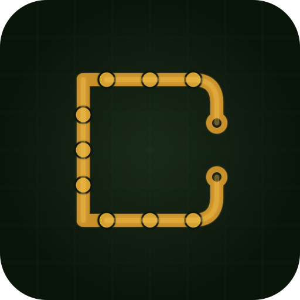

# esp-ai

A local-first, AI-assisted circuit design tool for ESP32 boards. Wire components in a 3D view, describe what you want to build, and the AI agent writes the firmware and simulates it — all before you touch a physical chip.



---

## Table of contents

1. [Features](#features)
2. [Prerequisites](#prerequisites)
3. [Installation](#installation)
4. [UI overview](#ui-overview)
5. [Creating a project](#creating-a-project)
6. [Extending the palette — adding components](#extending-the-palette--adding-components)
   - [component.json reference](#componentjson-reference)
   - [Pin definitions](#pin-definitions)
   - [Sim metadata](#sim-metadata)
   - [3D model (.glb)](#3d-model-glb)
   - [Schematic symbol](#schematic-symbol)
7. [Adding boards](#adding-boards)
8. [Using the agent](#using-the-agent)
   - [Agent tools reference](#agent-tools-reference)
   - [Prompting tips](#prompting-tips)
9. [Behaviors DSL](#behaviors-dsl)
   - [Triggers](#triggers)
   - [Actions](#actions)
10. [Firmware simulation](#firmware-simulation)
11. [Code generation](#code-generation)
12. [Build and flash](#build-and-flash)
13. [Project file format](#project-file-format)
14. [Architecture overview](#architecture-overview)
15. [Development](#development)

---

## Features

- **3D circuit view** — drag components onto the board, click pins to wire them, inspect nets in real time
- **AI agent** — describe a circuit in plain English; the agent adds components, wires them, runs DRC, and writes firmware
- **Firmware simulation** — behaviors defined by the agent run in the browser; GPIO outputs animate instantly with no hardware required
- **Code generation** — a complete ESP-IDF 5 C project (app_main.c, CMakeLists.txt, sdkconfig.defaults) is generated live from the project state
- **Build and flash** — one-click `idf.py build`, `idf.py flash`, and serial monitor, all streamed inside the app
- **Extensible catalog** — drop a `component.json` + `.glb` folder into `~/.esp-ai/catalog/` to add any component to the palette
- **Multi-board** — ESP32-DevKitC v4, ESP32-S3-DevKitC-1, ESP32-C3-DevKitM-1, ESP32-C6-DevKitC-1, XIAO ESP32-S3

---

## Prerequisites

| Requirement | Version | Notes |
|---|---|---|
| macOS | 13+ | Windows/Linux not tested yet |
| Node.js | 20+ | |
| pnpm | 9+ | `npm i -g pnpm` |
| ESP-IDF | 5.1+ | Only needed for Build/Flash; not required for design or simulation |

### ESP-IDF setup (optional)

Install via the [official guide](https://docs.espressif.com/projects/esp-idf/en/stable/esp32/get-started/). After installation, set the path:

```bash
export ESP_AI_IDF_PATH=/path/to/esp-idf   # default: /Users/$USER/esp/esp-idf
```

Add to your shell profile to make it permanent. If IDF is not installed, all design, simulation, and code generation features still work — only Build and Flash are disabled.

---

## Installation

```bash
git clone https://github.com/you/esp-ai
cd esp-ai
pnpm install
pnpm dev          # opens the Electron app in dev mode with hot reload
```

To build a distributable:

```bash
pnpm build
```

---

## UI overview

```
┌─────────────────────────────────────────────────────────────────────────────┐
│  esp-ai         [Project]  [Catalog Editor]              myproject ●  [Open] [Save]  [+ New] │
├──────────┬──────────────────────────────────┬────────────────────┬──────────┤
│          │                                  │                    │          │
│ Palette  │         3D Viewer                │ Schematic /        │  Agent   │
│          │                                  │ Behaviors          │          │
│ (catalog │   ● sim badge when running       │                    │  chat    │
│  list)   │                                  │                    │  window  │
│          ├──────────────────────────────────┤                    │          │
│          │   Code / Build / Sim             │                    │          │
│          │   [Code] [Build/Flash] [Sim ▶]   │                    │          │
└──────────┴──────────────────────────────────┴────────────────────┴──────────┘
```

| Pane | Purpose |
|---|---|
| **Palette** | Browse catalog components; click to add to the project |
| **3D Viewer** | Place and wire components; drag to reposition; click pins to connect |
| **Schematic / Behaviors** | Schematic view of the circuit; Behaviors tab to edit the firmware DSL |
| **Code** | Live-generated ESP-IDF C code; agent-written files shown with an `agent` badge |
| **Build / Flash** | Run `idf.py build`, flash to device, open serial monitor |
| **Sim** | Play/Stop/Reset simulation; speed control; real-time GPIO log |
| **Agent** | Chat with the AI agent; supports Anthropic Claude, OpenAI, and local Ollama models |

---

## Creating a project

1. Click **+ New Project** in the top-right
2. Choose a board from the picker
3. Name your project and click Create

Projects auto-save state in memory. Use **Save** (or `Cmd+S`) to persist to a `.espai.json` file. An amber `●` dot after the project name means there are unsaved changes.

To reopen a project: click **Open** and select the `.espai.json` file.

---

## Extending the palette — adding components

The component catalog lives at `~/.esp-ai/catalog/`. Each component is a folder containing:

```
~/.esp-ai/catalog/
└── my-component/
    ├── component.json    ← required
    └── model.glb         ← optional but recommended
```

The app loads all catalog entries at startup. Restart the app (or hot-reload in dev mode) to pick up new components.

### component.json reference

```jsonc
{
  "id": "my-sensor",              // unique id, must match the folder name
  "name": "My Sensor",            // human-readable label shown in the palette
  "version": "0.1.0",
  "category": "sensor",           // sensor | actuator | display | input | power | misc
  "model": "model.glb",           // path to the .glb file, relative to this folder
  "scale": 1.0,                   // uniform scale applied to the model (meters)

  "pins": [ /* see Pin definitions */ ],

  "power": {
    "current_ma": 10,             // peak current draw in milliamps
    "rail": "3v3"                 // "3v3" | "5v" | "vin"
  },

  "driver": {
    "language": "c",
    "defaultPinAssignments": { "data": "GPIO4" },
    "includes": ["driver/gpio.h"]
  },

  "schematic": { "symbol": "sensor" },  // see Schematic symbol

  "sim": { /* see Sim metadata */ }
}
```

### Pin definitions

Each entry in the `pins` array describes one physical pin:

```jsonc
{
  "id": "data",          // internal id — used in net references like "sensor1.data"
  "label": "DATA",       // label shown in the 3D view and schematic
  "type": "digital_io",  // electrical type — see table below
  "position": [0.0, -0.009, 0.0],  // XYZ position in meters, in the model's local frame
  "normal":   [0.0, -1.0,  0.0],   // wire exit direction (unit vector)

  // optional
  "protocol": "1wire",             // "1wire" | "i2c" | "spi" | "uart"
  "pull": "up_required",           // "none" | "up_required" | "down_required"
  "voltage": { "min": 3.3, "max": 3.3, "nominal": 3.3 }
}
```

**Pin types:**

| Type | Meaning |
|---|---|
| `digital_io` | bidirectional GPIO |
| `digital_in` | input only (e.g. LED anode) |
| `digital_out` | output only (e.g. sensor OUT) |
| `analog_in` | ADC input |
| `analog_out` | DAC / analog output |
| `power_in` | VCC / power supply input |
| `power_out` | power rail output |
| `ground` | GND |
| `i2c_sda` | I2C data |
| `i2c_scl` | I2C clock |
| `spi_mosi` / `spi_miso` / `spi_sck` / `spi_cs` | SPI bus |
| `uart_tx` / `uart_rx` | UART |
| `pwm` | PWM-capable pin |
| `nc` | not connected |

**Finding pin positions for a new model**

Pin positions must match the GLB model's local coordinate space. Use the built-in **Catalog Editor** (`Catalog Editor` tab in the nav bar):

1. Click **Load GLB** and pick your model file
2. Click on the model surface at each pin location — the app records the 3D position and normal
3. Name each pin and set its type
4. Click **Save to catalog** — writes `component.json` + copies the GLB to `~/.esp-ai/catalog/<id>/`

### Sim metadata

The `sim` field tells the simulator how to animate this component during firmware simulation:

```jsonc
"sim": {
  "role": "led",          // see roles table below
  "outputPin": "anode",   // pin id whose GPIO state drives the visual
  "inputPin": "a"         // pin id that fires a gpio_edge when the user clicks in sim mode
}
```

**Sim roles:**

| Role | `outputPin` effect | `inputPin` effect |
|---|---|---|
| `led` | glows red when GPIO is HIGH | — |
| `buzzer` | glows when GPIO is HIGH | — |
| `generic_output` | glows when GPIO is HIGH (relay, motor driver, etc.) | — |
| `servo` | glows when PWM signal GPIO is HIGH | — |
| `display` | glows when output GPIO is HIGH | — |
| `button` | — | click in 3D view fires a rising edge (press) and falling edge (release) |
| `generic_input` | — | click fires rising edge (PIR, potentiometer, DHT22, etc.) |

You can combine both fields — e.g. a component that both outputs and accepts clicks.

### 3D model (.glb)

- Format: binary glTF (`.glb`)
- Coordinate system: Y-up, units in **meters**
- Recommended: keep models small — typical components are 3–30 mm = 0.003–0.03 in model units
- Materials: standard PBR (`MeshStandardMaterial`). Emissive properties are overridden by the sim.
- If no GLB is provided, the app renders a colored box placeholder

### Schematic symbol

```jsonc
"schematic": {
  "symbol": "resistor"    // see symbol vocabulary below
}
```

**Available symbols:** `resistor`, `capacitor`, `led`, `button`, `potentiometer`, `display`, `ic`, `sensor`, `motor`, `relay`, `speaker`, `microphone`, `ledstrip`, `generic-rect`

If the symbol field is omitted the component renders as a generic labeled rectangle in the schematic view.

---

## Adding boards

Boards are defined in code at `src/catalog/index.ts`. To add a new board:

1. **Define the board** by adding a `BoardDef` object:

```typescript
const myBoard: BoardDef = {
  id: 'my-board-v1',                    // unique id
  name: 'My Board v1',
  version: '0.1.0',
  boardVersion: 'v1',
  category: 'misc',
  model: 'my-board.glb',                // GLB filename in assets
  target: 'esp32s3',                    // IDF target: esp32 | esp32s2 | esp32s3 | esp32c3 | esp32c6 | esp32h2

  features: ['Wi-Fi 6', 'BLE 5.0', 'USB CDC'],  // shown in board picker

  // Restricted pins — DRC checks these
  inputOnlyPins:  ['GPIO34', 'GPIO35'],
  strappingPins:  ['GPIO0', 'GPIO3', 'GPIO45', 'GPIO46'],
  flashPins:      ['GPIO27', 'GPIO28', 'GPIO29', 'GPIO30', 'GPIO31', 'GPIO32'],
  usbPins:        ['GPIO19', 'GPIO20'],    // native USB; triggers USB CDC config
  adc1Pins:       ['GPIO1', 'GPIO2', 'GPIO3'],
  adc2Pins:       ['GPIO11', 'GPIO12'],
  pwmCapablePins: [],                      // empty = all GPIO are PWM-capable
  railBudgetMa:   { '3v3': 600 },

  pins: [
    // Use the headerPins() helper for standard 2.54mm header rows
    ...headerPins('left', halfX, halfZ, [
      { id: '3v3',   label: '3V3', type: 'power_out' },
      { id: 'gnd_l', label: 'GND', type: 'ground'    },
      { id: 'gpio1', label: '1',   type: 'analog_in' },
      // ... one entry per pin
    ]),
    ...headerPins('right', halfX, halfZ, [
      // right header row
    ])
  ]
}
```

2. **Register it** by adding to the `boards` record near the bottom of the file:

```typescript
const boards: Record<string, BoardDef> = {
  [devkitc.id]:  devkitc,
  // ... existing boards
  [myBoard.id]:  myBoard,   // add here
}
```

3. **Pin positions** — the `headerPins(side, halfX, halfZ, labels)` helper places pins evenly along a header row. Parameters:
   - `side`: `'left'` (−Z edge) or `'right'` (+Z edge)
   - `halfX`: half the board length in meters (e.g. `0.022` for a 44mm board)
   - `halfZ`: half the board width in meters (e.g. `0.0145` for a 29mm board)
   - `labels`: array of `{ id, label, type }` from the pin closest to the USB end to the far end

4. **GLB model** — place the `.glb` file in `resources/` (Electron assets). Pin coordinates in the board definition must match the model's local coordinate space. The board mesh is centered at the origin in the 3D view.

> **Tip:** If you don't have a GLB yet, omit the `model` field (or point it at a non-existent file). The app renders a parametric green PCB placeholder automatically based on the pin bounding box.

---

## Using the agent

Open the **Agent** pane on the right. Select a model provider and key in the settings (gear icon), then type your request.

### Supported providers

| Provider | Setup |
|---|---|
| **Anthropic Claude** | Paste your API key in settings. Recommended: `claude-sonnet-4-5` or later. |
| **OpenAI** | Paste your API key. Works with `gpt-4o` and `o3`. |
| **Ollama** | Run `ollama serve` locally. Select any pulled model. No API key needed. |

### Agent tools reference

The agent has access to the following tools. You can reference these in prompts to guide behavior.

| Tool | What it does |
|---|---|
| `get_project` | Returns board, component list, net list, behaviors, DRC status |
| `list_catalog` | Lists all components with ids, names, categories, and pin ids |
| `add_component` | Adds a component instance to the project |
| `remove_component` | Removes an instance and its nets |
| `connect` | Wires two pins together (`"led1.anode"` → `"board.gpio16"`) |
| `run_drc` | Runs design rule checks; returns errors and warnings |
| `set_behavior` | Creates or replaces a firmware behavior (trigger + actions) |
| `remove_behavior` | Removes a behavior by id |
| `write_firmware` | Writes raw C code into `main/app_main.c` (bypasses behavior DSL) |
| `read_firmware` | Reads back a previously written firmware file |
| `save_project` | Saves the project to disk (overwrites if previously saved, else opens dialog) |
| `think` | Private reasoning step — no side effects |
| `fetch_url` | Fetches a URL and returns readable text (for datasheets, docs) |
| `list_glb_models` | Lists all registered GLB models |

### Prompting tips

**Start with a clear goal:**
> "Add an LED on GPIO16 with a 220Ω resistor, a push button on GPIO4, and write firmware that lights the LED while the button is held."

**The agent follows a fixed workflow:**
1. `think` to plan the BOM and wiring
2. `list_catalog` to check available components
3. `add_component` + `connect` for each component
4. `run_drc` after every wire
5. `set_behavior` for each firmware behavior
6. Summarises and tells you to click ▶ Play

**Iterate freely:**
> "The LED should also blink at 2Hz when not pressed."
> "Replace the button with a PIR sensor."

**The agent knows ESP32 constraints** — it will avoid strapping pins, check current limits, add pull-up resistors for I2C, and suggest safe GPIO numbers.

---

## Behaviors DSL

Behaviors are the single source of truth for firmware logic. They drive **both** the in-app simulator and the generated C code.

A behavior has one trigger and a list of actions:

```jsonc
{
  "id": "blink",
  "trigger": { "type": "timer", "period_ms": 500 },
  "actions": [
    { "type": "toggle", "target": "led1.anode" }
  ]
}
```

Edit behaviors manually in the **Behaviors** tab, or let the agent write them with `set_behavior`.

### Triggers

| Type | Required fields | When it fires |
|---|---|---|
| `boot` | — | Once at startup |
| `timer` | `period_ms` | Every N milliseconds |
| `gpio_edge` | `source`, `edge` | When a pin changes (`rising` / `falling` / `both`) |
| `wifi_connected` | — | When the device connects to Wi-Fi |

`source` for `gpio_edge` is a **pin ref**: `"instance.pinId"` (e.g. `"btn1.a"`) or `"board.pinId"` (e.g. `"board.gpio4"`).

### Actions

| Type | Required fields | What it does |
|---|---|---|
| `set_output` | `target`, `value` (`"on"` / `"off"`) | Drive a GPIO high or low |
| `toggle` | `target` | Flip a GPIO |
| `log` | `level`, `message` | Print to the sim console / serial monitor |
| `delay` | `ms` | Wait (approximated in simulator) |
| `sequence` | `actions` | Run a sub-list of actions in order |

`target` is a pin ref pointing at the component pin or board pin to drive.

**Pin refs** always follow the format `"instance.pinId"` — not raw GPIO numbers. The sim and codegen resolve the actual GPIO number from the net connections.

---

## Firmware simulation

Click **▶ Play** in the **Sim** tab (Code/Build/Sim panel) to start the simulator.

The simulator evaluates your behaviors in JavaScript at up to 10× speed:

- **Timer triggers** fire when the simulated clock crosses a period boundary
- **gpio_edge triggers** fire when a button or input component is clicked in the 3D view
- **GPIO outputs** animate immediately — LEDs glow, relays activate, WS2812B strips light up
- **Log actions** print to the Sim console

**Interacting during simulation:**

- Components with `sim.role: "button"` or `"generic_input"` show a blue highlight ring
- Click and hold a button → `rising` edge fires → LED turns on
- Release → `falling` edge fires → LED turns off
- Rapid clicks each fire their own edge (no debounce in sim v0)

**Speed control:** 1×, 2×, 5×, 10× — adjusts how fast simulated time advances relative to wall time.

The sim stops automatically if DRC errors appear while it's running.

---

## Code generation

The **Code** tab shows a live-generated ESP-IDF 5 project, updated as you edit the circuit. Three files are generated:

| File | Contents |
|---|---|
| `main/app_main.c` | Includes, GPIO init, behavior tasks, `app_main` |
| `main/CMakeLists.txt` | `idf_component_register` with all required IDF components |
| `sdkconfig.defaults` | `CONFIG_IDF_TARGET`, FreeRTOS Hz, CPU frequency, USB CDC (board-specific) |

The code generator covers:
- GPIO output/input init from net connections
- I2C bus init (when I2C components are present)
- `xTaskCreate` / `vTaskDelayUntil` for `timer` behaviors
- `gpio_set_level` / `gpio_set_direction` for `set_output` and `toggle` actions
- `ESP_LOGI/W/E` for `log` actions

If the agent writes raw firmware via `write_firmware`, those files appear as additional tabs in the Code pane with an `agent` badge and override the generated output.

---

## Build and flash

Open the **Build / Flash** tab.

1. **Select a serial port** — click ↻ to rescan, then pick your device (e.g. `/dev/cu.usbserial-0001`)
2. **▶ Build** — writes the generated C project to `~/esp-ai/projects/<name>/` and runs `idf.py build`
3. **⚡ Flash** — runs `idf.py flash` to the selected port
4. **📟 Monitor** — opens `idf.py monitor` to stream serial output from the device
5. **■ Stop** — kills the current operation (SIGINT → SIGKILL after 1.5s)
6. **Clean** — runs `idf.py fullclean`

Build output streams in real time. Errors appear in red, metadata in green.

> **First build is slow** — `idf.py set-target` runs only once per project, configuring the toolchain for the selected chip. Subsequent builds are incremental.

---

## Project file format

Projects are saved as `.espai.json`. The format is stable and human-readable:

```jsonc
{
  "schemaVersion": 1,
  "name": "blink-button",
  "target": "esp32",
  "board": "esp32-devkitc-v4",

  "components": [
    {
      "instance": "r1",
      "componentId": "resistor-220r",
      "position": [0.033, 0.005, 0.015],
      "pinAssignments": {}
    },
    {
      "instance": "led1",
      "componentId": "led-5mm-red",
      "position": [0.048, 0.005, 0.015],
      "pinAssignments": {}
    }
  ],

  "nets": [
    { "id": "net1", "endpoints": ["board.gpio16", "r1.in"] },
    { "id": "net2", "endpoints": ["r1.out", "led1.anode"] },
    { "id": "net3", "endpoints": ["led1.cathode", "board.gnd_l"] }
  ],

  "behaviors": [
    {
      "id": "blink",
      "trigger": { "type": "timer", "period_ms": 500 },
      "actions": [{ "type": "toggle", "target": "led1.anode" }]
    }
  ],

  "app": {
    "wifi": { "enabled": false },
    "log_level": "info"
  }
}
```

`schemaVersion` is `1`. Future breaking changes will increment this field.

---

## Architecture overview

```
src/
├── agent/          # LLM integration
│   ├── anthropic.ts / openai.ts / ollama.ts   # provider adapters
│   ├── chatSession.ts                          # turn loop, tool dispatch
│   ├── tools.ts                                # all tool definitions + executors
│   └── expertPrompt.ts                         # system prompt for expert mode
│
├── catalog/
│   ├── index.ts        # in-memory catalog: boards + inline components
│   └── hydrate.ts      # loads ~/.esp-ai/catalog/ on startup
│
├── codegen/
│   ├── ir.ts           # intermediate representation: resolves nets → GPIO numbers
│   └── generate.ts     # emits app_main.c, CMakeLists.txt, sdkconfig.defaults
│
├── drc/
│   └── index.ts        # design rule checks (strapping pins, flash pins, short circuits…)
│
├── panes/
│   ├── Viewer3D.tsx     # 3D scene, component placement, wiring, sim visuals
│   ├── Schematic.tsx    # 2D schematic view
│   ├── ChatPane.tsx     # agent chat UI
│   ├── CodePane.tsx     # generated code viewer
│   ├── BuildPane.tsx    # build/flash/monitor UI
│   ├── SimPane.tsx      # sim controls + log
│   └── Palette.tsx      # component browser sidebar
│
├── project/
│   ├── schema.ts       # Project, Behavior, Action, Net types
│   └── component.ts    # ComponentDef, BoardDef, SimDef, PinDef types
│
├── sim/
│   ├── evaluate.ts     # behavior evaluator: advances sim time, fires triggers
│   └── useSimLoop.ts   # React hook: 100ms interval, mounted in App.tsx
│
└── store.ts            # Zustand store: all app state + actions

electron/
├── main.ts     # IPC handlers: file dialogs, catalog IO, idf.py pipeline
└── preload.ts  # contextBridge: exposes window.espAI to the renderer
```

**Data flow:**

```
Project state (store)
  │
  ├──► generate.ts ──► Code pane (live C code)
  │
  ├──► evaluate.ts ──► sim visuals (Viewer3D)
  │
  ├──► drc/index.ts ──► DRC overlay + sim guard
  │
  └──► agent/tools.ts ──► LLM ──► mutations back to store
```

---

## Development

```bash
pnpm dev          # Electron + Vite hot reload
pnpm typecheck    # TypeScript check (both node and web tsconfigs)
```

**Adding a new agent tool:**

1. Add a `ToolDef` entry to the `tools` array in `src/agent/tools.ts`
2. Add the executor `case` in `executeInternal`
3. Mention the tool in `expertPrompt.ts` if the agent should use it proactively

**Adding a new behavior action:**

1. Add the new type to the `Action` union in `src/project/schema.ts`
2. Handle it in `src/sim/evaluate.ts` → `runActions`
3. Handle it in `src/codegen/generate.ts` → `emitActions`
4. Add it to the `set_behavior` tool schema in `src/agent/tools.ts`

**Adding a new trigger type:**

1. Add to `TriggerKind` in `src/project/schema.ts`
2. Handle in `src/sim/evaluate.ts` → `firesInWindow`
3. Handle in `src/codegen/generate.ts` (may need a new task template)
4. Add to the `set_behavior` tool schema
